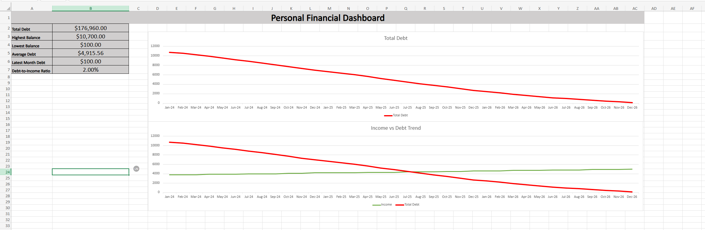

# Personal Financial Dashboard (Excel)

## Project Overview

This project is an Excel-based financial analytics dashboard designed to track income, credit card balances, and total debt over time.

The dashboard provides KPI metrics and visualizations to monitor financial trends and debt payoff progress.

## Features

* Multi-year financial tracking dataset
* Credit card balance monitoring
* Income vs Debt visualization
* Debt-to-Income ratio KPI
* Automated Excel formulas
* Dashboard layout with multiple charts

## Tools Used

* Microsoft Excel
* Data visualization
* Financial KPI analysis

## Dashboard Preview

## Files

* `personal_financial_dashboard.xlsx` — interactive dashboard
* `dashboard_preview.png` — dashboard screenshot
